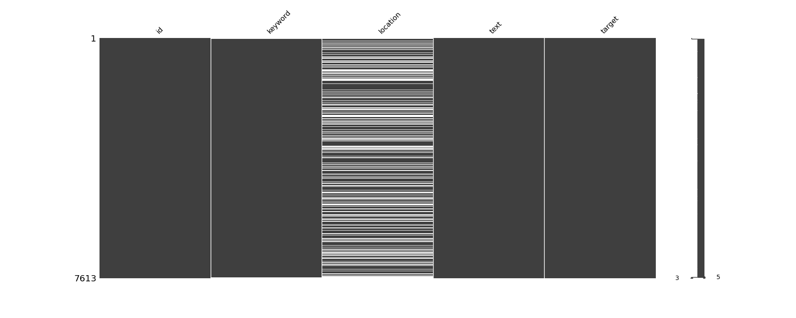
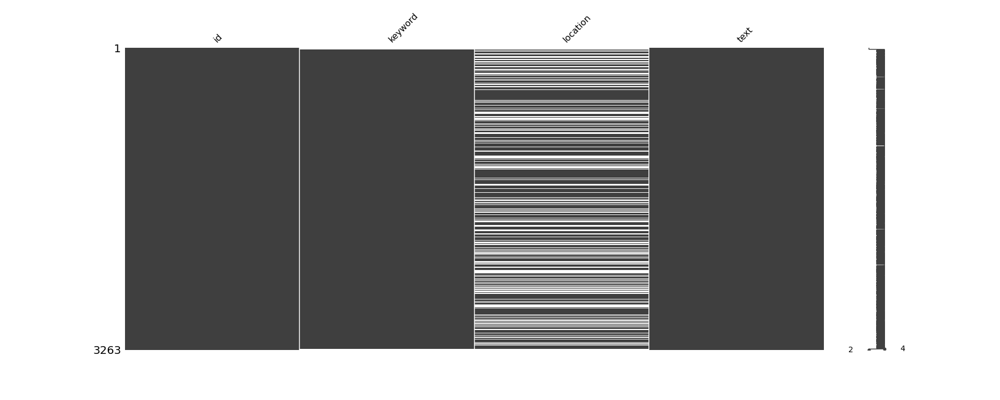

#  True or False? Disaster Recognition from Tweets


## Abstract

This particular capstone focuses on using machine learning to pick up tweets related to disasters from a series of tweets. 

## Introduction

Twitter has become a prevalent communication channel in times of emergency.
The ubiquitous smartphones enables people to announce an emergency in real-time. Because of this, more agencies are interested in programatically monitoring Twitter (i.e. FEMA, disaster relief organizations, and news agencies).


### Data Source

The dataset used in the capstone is collected from this link: [Kaggle Link](https://www.kaggle.com/c/nlp-getting-started/data)

Demonstrate that you have looked at your data. What are your columns?

#### Columns

* `id (int64 type)`: a unique identifier for each tweet
* `text(str type)`: the test of the tweet
* `location(str type)`: the location the tweet was sent from (may be blank)
* `keyword(str type)`: a particular keyword from the tweet (may be blank)
* `target (int64 type)`: present in `train.csv` only, this denote whether the tweet is about a real disaster (`1`) or not (`0`)

#### EDA

<b>Training Data<b>
    
```
Data columns (total 5 columns):
 #   Column    Non-Null Count  Dtype 
---  ------    --------------  ----- 
 0   id        7613 non-null   int64 
 1   keyword   7552 non-null   object
 2   location  5080 non-null   object
 3   text      7613 non-null   object
 4   target    7613 non-null   int64 
```


    
---
    
Test Data

```
Data columns (total 4 columns):
 #   Column    Non-Null Count  Dtype 
---  ------    --------------  ----- 
 0   id        3263 non-null   int64 
 1   keyword   3237 non-null   object
 2   location  2158 non-null   object
 3   text      3263 non-null   object
```
    

---

### Objective

#### MVP

Build a deep learning model for this binary classification problem with reasonable accuracy.

#### Streach Goal

Try out different models and compare their performances

## Dataset and Exploratory Data Analysis

## Methodology

## Results

## Discussion


