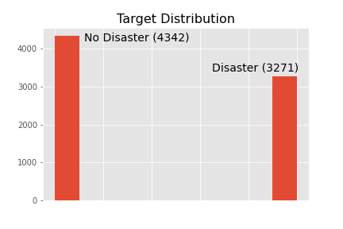
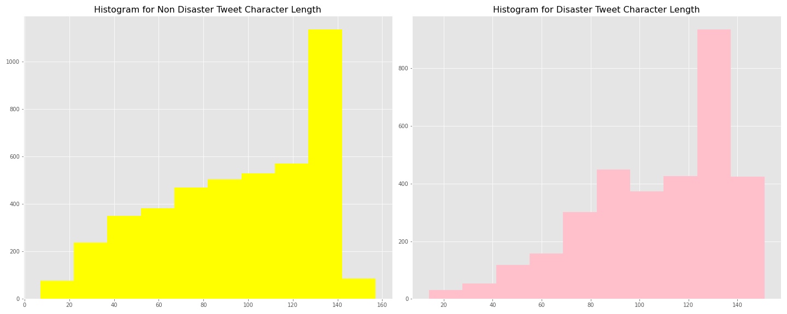
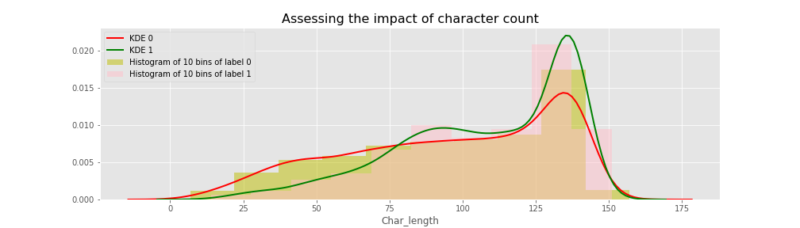
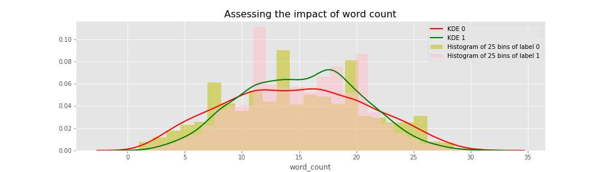
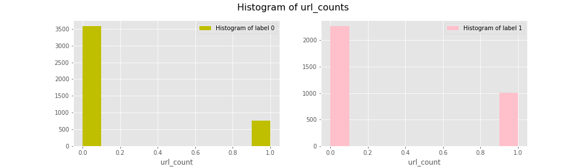
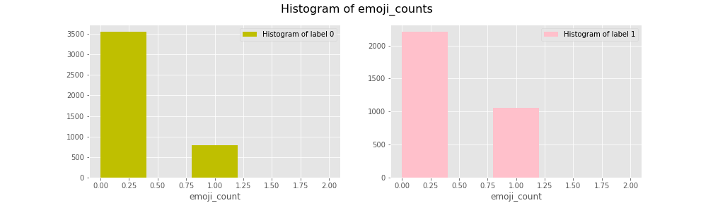
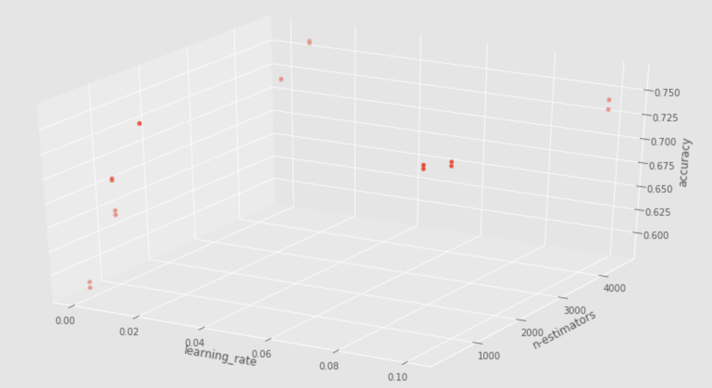
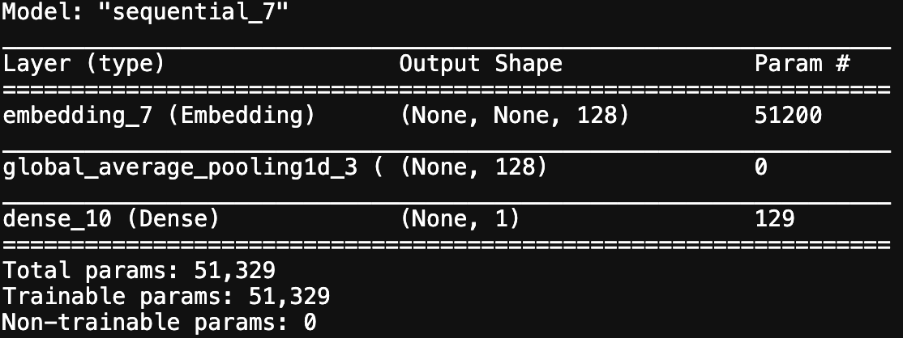
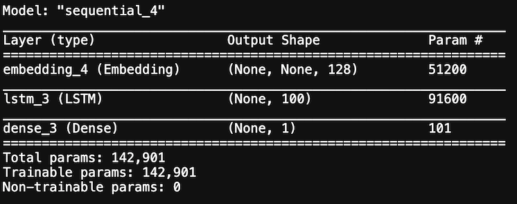
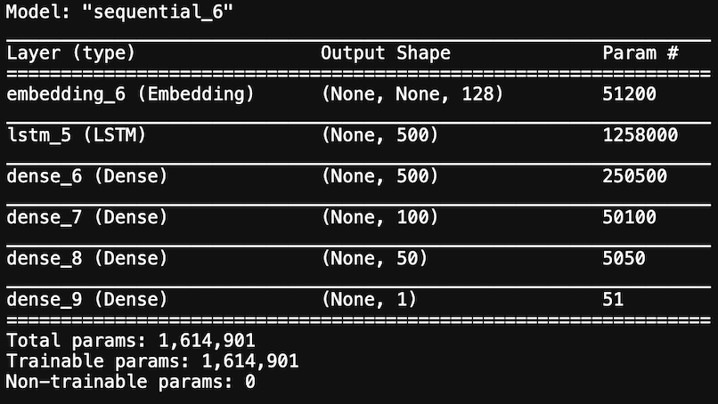

#  Twitter as a Disaster Sensor


## Abstract

This particular capstone focuses on using machine learning to pick up tweets related to disasters from a series of tweets. 

## Introduction

Twitter has become a prevalent communication channel in times of emergency.
The ubiquitous smartphones enables people to announce an emergency in real-time. Because of this, more agencies are interested in programatically monitoring Twitter (i.e. FEMA, disaster relief organizations, and news agencies).


### Data Source

The dataset used in the capstone is collected from this link: [Kaggle Link](https://www.kaggle.com/c/nlp-getting-started/data)

Demonstrate that you have looked at your data. What are your columns?

#### Columns

* `id (int64 type)`: a unique identifier for each tweet
* `text(str type)`: the test of the tweet
* `location(str type)`: the location the tweet was sent from (may be blank)
* `keyword(str type)`: a particular keyword from the tweet (may be blank)
* `target (int64 type)`: present in `train.csv` only, this denote whether the tweet is about a real disaster (`1`) or not (`0`)

#### EDA

Training Data
    
```
Data columns (total 5 columns):
 #   Column    Non-Null Count  Dtype 
---  ------    --------------  ----- 
 0   id        7613 non-null   int64 
 1   keyword   7552 non-null   object
 2   location  5080 non-null   object
 3   text      7613 non-null   object
 4   target    7613 non-null   int64 
```





Out of 5080 locations, there are 3341 unique locations, with top 10 locations and their # of occurances being:
    
```
[('USA', 104),
 ('New York', 71),
 ('United States', 50),
 ('London', 45),
 ('Canada', 29),
 ('Nigeria', 28),
 ('UK', 27),
 ('Los Angeles, CA', 26),
 ('India', 24),
 ('Mumbai', 22)]
```
    
The top 10 locations (out of 1513 unique locations) for the diaster tweets are:

```
[('USA', 67),
 ('United States', 27),
 ('Nigeria', 22),
 ('India', 20),
 ('Mumbai', 19),
 ('UK', 16),
 ('London', 16),
 ('New York', 16),
 ('Washington, DC', 15),
 ('Canada', 13)]
```
The top 10 locations (out of 2142 unique locations) for the non diaster tweets are:
    
```
[('New York', 55),
 ('USA', 37),
 ('London', 29),
 ('United States', 23),
 ('Los Angeles, CA', 18),
 ('Canada', 16),
 ('Kenya', 15),
 ('Everywhere', 12),
 ('UK', 11),
 ('Florida', 11)]
```
    
    
Out of 7552 keywords, there are 211 unique keywords, with top 10 keywords and their occurances being:
    
```
[('fatalities', 45),
 ('armageddon', 42),
 ('deluge', 42),
 ('body%20bags', 41),
 ('damage', 41),
 ('harm', 41),
 ('sinking', 41),
 ('collided', 40),
 ('evacuate', 40),
 ('fear', 40)]
    
```

The top 10 keywords (out of 220 unique keywords) for the disaster tweets are:
```    
[('derailment', 39),
 ('outbreak', 39),
 ('wreckage', 39),
 ('debris', 37),
 ('oil%20spill', 37),
 ('typhoon', 37),
 ('evacuated', 32),
 ('rescuers', 32),
 ('suicide%20bomb', 32),
 ('suicide%20bombing', 32)]
```
    
The top 10 keywords (out of 218 unique keywords) for the non disaster tweets are:

```
[('body%20bags', 40),
 ('armageddon', 37),
 ('harm', 37),
 ('deluge', 36),
 ('ruin', 36),
 ('wrecked', 36),
 ('explode', 35),
 ('fear', 35),
 ('siren', 35),
 ('twister', 35)]    
```

From EDA, it was determined that there are 23061 unique words, with top 10 words and their occurances being:
    
```
[('http', 9012),
 ("'s", 754),
 ('like', 753),
 ('...', 730),
 ('amp', 624),
 ("n't", 616),
 ('fire', 602),
 ('get', 537),
 ("'m", 490),
 ('new', 446)]
```




`http` and `https` were dropped because they don't contain any meaningful information in isolation:
 
```
    '.@NorwayMFA #Bahrain police had previously died in a road accident they were not killed by explosion https://t.co/gFJfgTodad'
```


Also, I see the # of urls seems to have a different distributions between disaster and non-disaster tweets. At this point, I have decided to put two columns one for `url_count` and another for `urls`.
    

    
    
---
    
Test Data

```
Data columns (total 4 columns):
 #   Column    Non-Null Count  Dtype 
---  ------    --------------  ----- 
 0   id        3263 non-null   int64 
 1   keyword   3237 non-null   object
 2   location  2158 non-null   object
 3   text      3263 non-null   object
```
    

---

### Objective

#### MVP

Build a learning model for this binary classification problem with reasonable accuracy.


## Feature Engineering
    
* Parse rich text data to extract urls and emojis
* Set urls as string, url count, and emoji count as three new attributes
* Tfidf vectorize the text atrribute with maxlength=500  
* Count vectorize the location, keyword, and url for maxlength=100


## Baseline Models
    
| Model    | Parameters  |  Accuracy |  Precision |  Recall   |  F1-Score    |
|----------|-------------|-----------|------------|-----------|--------------|
| Bernoulli Naive Bayes |  Default | 0.76 | 0.73 | 0.65 | 0.69 |
| Random Forest Classifier |  max_depth=100   |   0.77 | 0.78 | 0.62 | 0.69 |
| Gradient Boosting Classifier | learning_rate=0.001,min_sam_leaf=10, n_estimators=2000 | 0.7 | 0.84 | 0.33 | 0.47 |
| XG Boost Classifier |learning_rate=0.1, n_estimators=140, max_depth=5 | 0.76| 0.8 | 0.57 | 0.67 |


## Grid Search on Gradient Boosting Classifier
    
```
    parameters = {
        "learning_rate": [0.001, 0.01, 0.1],
        "subsample":[0.5, 0.75],
        "n_estimators":[300, 900, 4500]
    }
    
```
    
* best hypterparameters: GradientBoostingClassifier(n_estimators=300, subsample=0.75))
    
* accuracy: 0.76
* precision: 0.92
* recall: 0.66
    
 
    
* It seems more estimator is needed. 
    
## Experiments with Deep Learning
    

    
### Model 1: Embedding Model -> garbage 
<!--  -->

    
* can't split classes (two very close probabilities)
* output is negative
    
### Model 2: Embedding-LSTM Model -> 59% accuracy


<!--  -->
* reduce the batch size to 20
* by default, `tf.keras.layers.Dense` takes linear activation which does not make sense because we are dealing with a classification problem
* model.compile(optimizer='adam',loss=tf.keras.losses.BinaryCrossentropy(~~from_logits=True~~),metrics=METRICS)
* add `LSTM(100)` layer
* drop conv layer


### Model 3: Embedding-LSTM + Dense Output Model -> 62% accuracy
    

<!--  -->
* add a `model.add(Dense(500, activation='relu'))` layer before the output unit

        
### Model 4: Embedding-LSTM-Dense + More Features -> 65% accuracy 
*  `word_max_features=5000, keyword_max_features=100, ocation_max_features=50, url_max_features=50, embedding_dim = 256`
    
### Model 5 (Add deep output layers)



---

## Lessons Learned
    
*  Start with a simple model
*  Minimize notebook usage
*  Get familiar with TensorFlow end-to-end
*  Perform EDA over the weekend
*  Minimize unknown risks
    
## Next Steps
    
*  Tune exist models
*  Use BERT and other transfer learning frameworks

